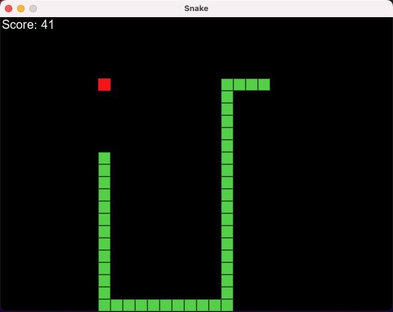
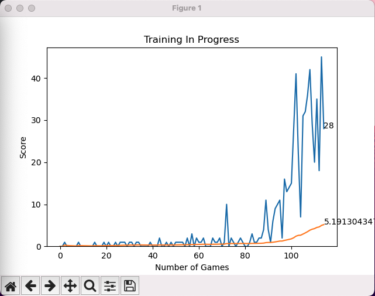

# reinforcement-learning-ai-learns-snake

This project involves developing and training an AI agent that learns to play snake using reinforcement learning.\
The agent learns from the environment and trains based on rewards and penalties. \
This project utilises PyTorch to create a neural network to train the AI agent based on Deep Q learning.
&nbsp;

&nbsp;

AI Snake Learning to Play:

Graph Showing Scores Per Game While Training:

